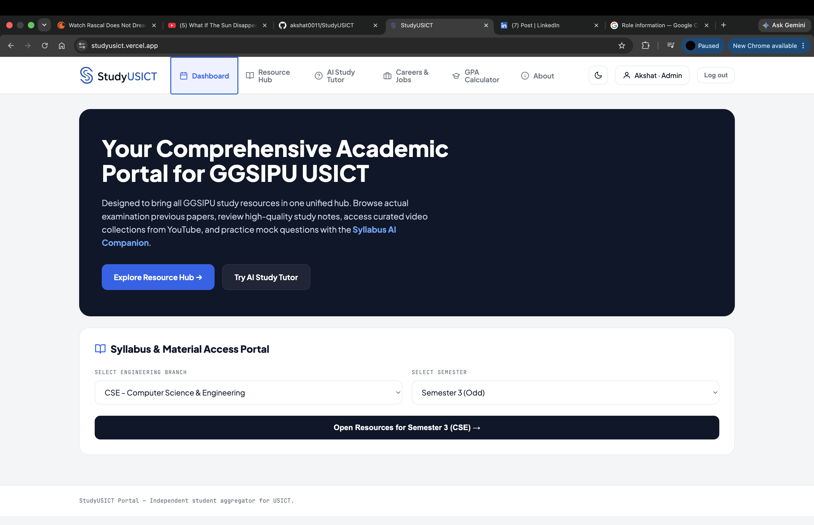
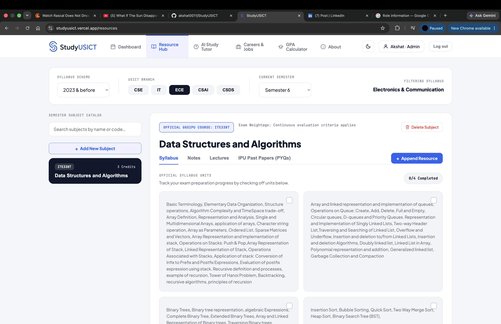
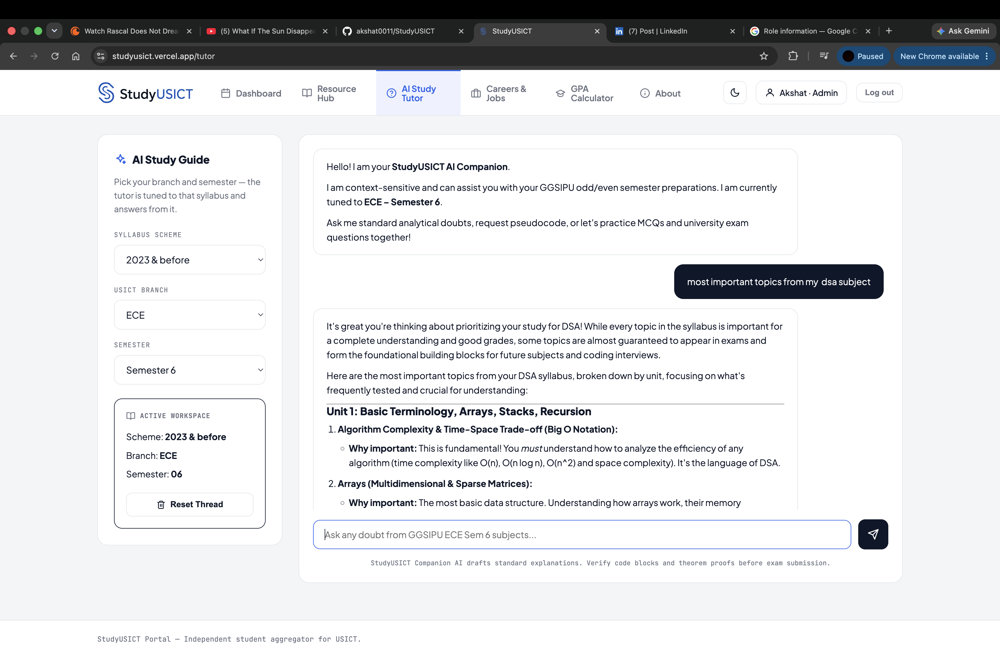
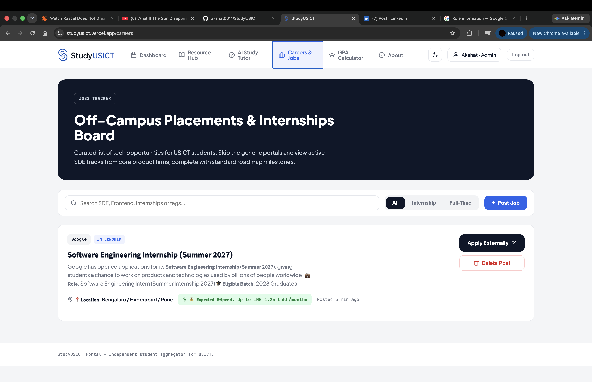
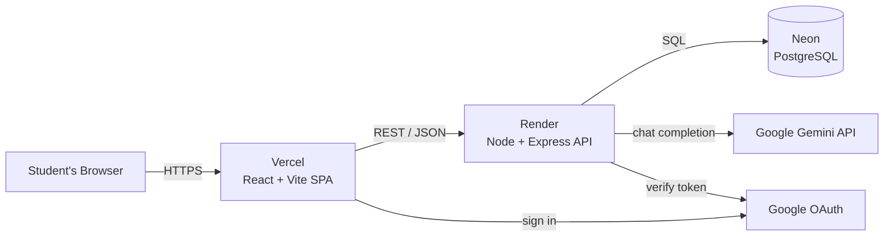

<div align="center">

<picture>
  <source media="(prefers-color-scheme: dark)" srcset="client/src/assets/logo-dark.png">
  
</picture>

### Everything a USICT student needs — in one place.

A full-stack study portal for **USICT, GGSIPU**: syllabus, notes, previous-year papers, curated lectures, an AI study tutor, a jobs board, and a GPA calculator — organized by branch and semester.

[](https://studyusict.vercel.app)


</div>

---

## 📸 Screenshots

<table>
  <tr>
    <td width="50%"><br><div align="center"><b>Dashboard</b></div></td>
    <td width="50%"><br><div align="center"><b>Resource Hub</b></div></td>
  </tr>
  <tr>
    <td width="50%"><br><div align="center"><b>AI Study Tutor</b></div></td>
    <td width="50%"><br><div align="center"><b>Careers & Jobs</b></div></td>
  </tr>
</table>

---

## ✨ Features

- 🎓 **Resource Hub** — Browse the official syllabus, notes, curated YouTube lectures, and IPU previous-year papers (PYQs), filtered by **syllabus scheme → branch → semester**. Tick off syllabus units to track exam-prep progress (saved in your browser).
- 🤖 **AI Study Tutor** — A chat tutor powered by **Google Gemini** that's *grounded in the real syllabus*: it pulls the selected semester's subjects and units straight from the database, so explanations, pseudocode, and practice questions stay relevant to what you're actually studying.
- 💼 **Careers & Jobs Board** — A curated feed of off-campus internships and full-time roles, with search, type filters, tags, and direct apply links.
- 🧮 **GPA Calculator** — Compute your SGPA on the GGSIPU grade scale, plus an instant CGPA → percentage conversion (CGPA × 9.5).
- 🔐 **Authentication** — Email/password (bcrypt-hashed) **and** Google sign-in (OAuth), with JWT sessions. Admin-only controls for managing content.
- 🌗 **Light / dark theme** — Theme preference persists across visits.

---

## 🛠 Tech Stack

| Layer | Technologies |
|---|---|
| **Frontend** | React 19, Vite, React Router v7, `@react-oauth/google`, `react-markdown` |
| **Backend** | Node.js, Express 5, JSON Web Tokens, bcrypt, `express-rate-limit` |
| **Database** | PostgreSQL (hosted on **Neon**), accessed with `pg` |
| **AI** | Google Gemini (`gemini-2.5-flash`) |
| **Auth** | JWT + Google OAuth (`google-auth-library`) |
| **Hosting** | Frontend on **Vercel**, API on **Render**, database on **Neon** |

---

## 🏗 Architecture



The React SPA talks to a stateless Express API over REST. The API owns all data access (Postgres) and the AI integration, and verifies both its own JWTs and Google identity tokens. Every database query uses parameterized statements.

---

## 🚀 Getting Started

**Prerequisites:** Node.js 18+, and a PostgreSQL connection string (e.g. a free [Neon](https://neon.tech) database).

```bash
# 1. Clone
git clone https://github.com/akshat0011/StudyUSICT.git
cd StudyUSICT

# 2. Backend
cd server
npm install
cp .env.example .env          # then fill in the values (see below)
node index.js                 # runs on http://localhost:3000

# 3. Frontend (in a second terminal)
cd client
npm install
npm run dev                   # runs on http://localhost:5173
```

### Environment variables

**`server/.env`** (see [`server/.env.example`](server/.env.example)):

| Variable | Description |
|---|---|
| `DATABASE_URL` | PostgreSQL connection string (Neon) |
| `JWT_SECRET` | Secret used to sign login tokens |
| `GOOGLE_CLIENT_ID` | Google OAuth client ID |
| `GEMINI_API_KEY` | Google Gemini API key (AI tutor) |
| `PORT` | API port (defaults to `3000`) |
| `CORS_ORIGIN` | _Production:_ allowed frontend origin(s) |
| `TRUST_PROXY` | _Production:_ set to `1` behind a hosting proxy |

**`client/.env`** _(optional — sensible defaults in dev)_:

| Variable | Description |
|---|---|
| `VITE_API_URL` | API base URL (defaults to `http://localhost:3000`) |
| `VITE_GOOGLE_CLIENT_ID` | Google OAuth client ID for the sign-in button |

The database tables are created automatically on first run.

---

## 📁 Project Structure

```
.
├── client/                 # React + Vite frontend
│   └── src/
│       ├── DashboardPage.jsx     # landing + branch/semester picker
│       ├── ResourceHubPage.jsx   # syllabus / notes / lectures / PYQs
│       ├── AITutorPage.jsx       # Gemini-powered study tutor
│       ├── CareersPage.jsx       # internships & jobs board
│       ├── GpaPage.jsx           # SGPA + CGPA→% calculator
│       ├── LoginPage.jsx         # email/password + Google sign-in
│       ├── branches.js           # shared branch list
│       ├── schemes.js            # shared syllabus-scheme list
│       └── index.css             # all styles (light/dark via CSS vars)
└── server/                 # Express API
    ├── index.js                  # routes, auth, rate limiting, AI tutor
    ├── db.js                     # Postgres pool + table definitions
    └── .env.example              # documented environment variables
```

---

## 🔌 API Overview

| Method | Endpoint | Access | Purpose |
|---|---|---|---|
| `POST` | `/signup` · `/login` | Public | Create account / log in (rate-limited) |
| `POST` | `/auth/google` | Public | Sign in with Google |
| `GET` | `/me` | Auth | Current user's profile |
| `GET` | `/subjects` | Public | Syllabus catalog by scheme/branch/semester |
| `GET` | `/materials` · `/jobs` | Public | Study materials / job listings |
| `POST` | `/tutor` | Public | Syllabus-aware AI tutor reply (rate-limited) |
| `POST` `DELETE` | `/subjects` · `/materials` · `/jobs` | Admin | Manage content |

All write routes are protected by JWT auth + an admin-role check.

---

## 🔒 Security

- Passwords hashed with **bcrypt**; sessions via signed **JWTs**.
- **Parameterized SQL** everywhere (no string-built queries).
- **Rate limiting** on auth routes and the AI tutor.
- Server-side input validation; emails normalized to avoid duplicate accounts.
- Configurable **CORS** allow-list and proxy-aware client-IP handling for production.

---

## 🗺 Roadmap

- [ ] Bulk import for the subject catalog
- [ ] Student-submitted resources (with admin approval)
- [ ] Link-out to the official IPU result portal
- [ ] Per-user progress that syncs across devices
- [ ] Usage analytics

---

## 👤 Author

**Akshat Saroha** — student at USICT, GGSIPU.

[](https://github.com/akshat0011)
[](https://linkedin.com/in/akshatsaroha)

> Built to bring every scattered USICT study resource into one fast, clean place — and to be a product real students actually use.
